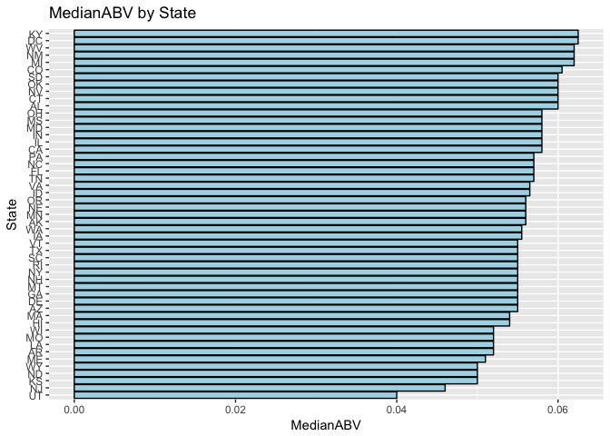
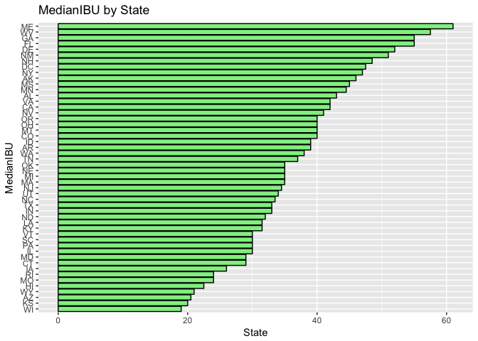

From initial review of the information provided we will show how many breweries are present within each state.


```r
library(stringr)
library(tidyverse)
```

```
## ── Attaching packages ────────────────────────────────── tidyverse 1.2.1 ──
```

```
## ✔ ggplot2 2.2.1     ✔ readr   1.1.1
## ✔ tibble  1.4.2     ✔ purrr   0.2.4
## ✔ tidyr   0.8.0     ✔ dplyr   0.7.4
## ✔ ggplot2 2.2.1     ✔ forcats 0.3.0
```

```
## Warning: package 'tibble' was built under R version 3.4.3
```

```
## Warning: package 'tidyr' was built under R version 3.4.3
```

```
## Warning: package 'forcats' was built under R version 3.4.3
```

```
## ── Conflicts ───────────────────────────────────── tidyverse_conflicts() ──
## ✖ dplyr::filter() masks stats::filter()
## ✖ dplyr::lag()    masks stats::lag()
```

```r
Breweries <- read.csv("Breweries.csv", header=TRUE, sep = ',', stringsAsFactors = FALSE)

# Check City spelling
Breweries <- Breweries[with(Breweries, order(State,City,Name)),]

BreweriesClean <- Breweries
BreweriesClean <- BreweriesClean[with(BreweriesClean, order(Brew_ID)),]

# Misspelled City Names, researched official spelling 
BreweriesClean[c(59,139),3] <- "Saint Paul" 
BreweriesClean[130,3] <- "St. Marys" 
BreweriesClean[68,3] <- "St. Petersburg" 
BreweriesClean[339,3] <- "St. Johns" 
BreweriesClean[c(378,457),3] <- "Menomonie" 
BreweriesClean[69,3] <- "Mount Airy" 
BreweriesClean[385,3] <- "Mount Pleasant" 

# Incorrect State for given City
BreweriesClean[96,4] <- "MI" 

# Check for duplicate Breweries after removing Brewery and Brewing Company
BreweriesClean$BrewDups = BreweriesClean$Name
  
# Remove "Brewery", "Brewing Company", "Brewing", "Beer Co.", 
BreweriesClean$BrewDups <- str_replace_all(BreweriesClean$BrewDups, "Brewery", "")
BreweriesClean$BrewDups <- str_replace_all(BreweriesClean$BrewDups, "Brewing", "")
BreweriesClean$BrewDups <- str_replace_all(BreweriesClean$BrewDups, "Beer", "")
BreweriesClean$BrewDups <- str_replace_all(BreweriesClean$BrewDups, "Cider", "")
BreweriesClean$BrewDups <- str_replace_all(BreweriesClean$BrewDups, "Company", "")
BreweriesClean$BrewDups <- str_replace_all(BreweriesClean$BrewDups, "co.", "")
BreweriesClean$BrewDups <- str_replace_all(BreweriesClean$BrewDups, " ", "")

# Convert all characters to lower so we can better find potential duplicates
BreweriesClean$BrewDups <- tolower(BreweriesClean$BrewDups)
# Paste Name converted to lower, City, and State for matching duplicates
BreweriesClean <- unite(BreweriesClean, BrewDupsFreq, BrewDups, City, State, sep = ",", remove = FALSE)

# Determine if multiples are present
dupNames <- as.data.frame(table(BreweriesClean$BrewDupsFreq))
dupNames <- subset(dupNames, dupNames$Freq>1)

BreweriesCleanDups <- BreweriesClean[BreweriesClean$BrewDupsFreq %in%  dupNames$Var1,]
BreweriesCleanDups <- BreweriesCleanDups[order(BreweriesCleanDups$BrewDupsFreq),]

# Review results
BreweriesCleanDups
```

```
##     Brew_ID                         Name                   BrewDupsFreq
## 2         2    Against the Grain Brewery againstthegrain,Louisville, KY
## 63       63    Against The Grain Brewery againstthegrain,Louisville, KY
## 147     147                 Angry Minnow        angryminnow,Hayward, WI
## 543     543 Angry Minnow Brewing Company        angryminnow,Hayward, WI
## 89       89 Goose Island Brewing Company        gooseisland,Chicago, IL
## 197     197 Goose Island Brewery Company        gooseisland,Chicago, IL
## 378     378      Lucette Brewing Company          lucette,Menomonie, WI
## 457     457      Lucette Brewing Company          lucette,Menomonie, WI
## 59       59       Summit Brewing Company          summit,Saint Paul, MN
## 139     139       Summit Brewing Company          summit,Saint Paul, MN
##           City State        BrewDups
## 2   Louisville    KY againstthegrain
## 63  Louisville    KY againstthegrain
## 147    Hayward    WI     angryminnow
## 543    Hayward    WI     angryminnow
## 89     Chicago    IL     gooseisland
## 197    Chicago    IL     gooseisland
## 378  Menomonie    WI         lucette
## 457  Menomonie    WI         lucette
## 59  Saint Paul    MN          summit
## 139 Saint Paul    MN          summit
```

```r
# Fix based on observations and other data discovery
BreweriesClean[2,2] <- "Against The Grain Brewery"
BreweriesClean[147,2] <- "Angrew Minnow Brewing Company"
BreweriesClean[197,2] <- "Goose Island Brewing Company"
BreweriesClean[380,2] <- "Grey Sail Brewing Company"
BreweriesClean[396,2] <- "Hops & Grains Brewing Company"

# Brew_ID with Duplicate Rows: 2 & 63, 89 & 197, 147 & 543, 378 & 457, 59 & 139
BreweriesClean$BrewDupsFreq <- NULL
BreweriesClean$BrewDups <- NULL
```

### Question 1
Count by State, probably  needs to be based on Brewery_Name given the cleaning...


```r
# Make use of cleaned data set
BreweryByState <- table(factor(BreweriesClean$State))
BreweryByState <- data.frame(BreweryByState)

# Rename columns to something meaningful
colnames(BreweryByState) <- c('State','Count')

BreweryByState
```

```
##    State Count
## 1     AK     7
## 2     AL     3
## 3     AR     2
## 4     AZ    11
## 5     CA    39
## 6     CO    47
## 7     CT     8
## 8     DC     1
## 9     DE     2
## 10    FL    15
## 11    GA     7
## 12    HI     4
## 13    IA     5
## 14    ID     5
## 15    IL    18
## 16    IN    22
## 17    KS     3
## 18    KY     4
## 19    LA     5
## 20    MA    22
## 21    MD     7
## 22    ME     9
## 23    MI    32
## 24    MN    12
## 25    MO     9
## 26    MS     2
## 27    MT     9
## 28    NC    19
## 29    ND     1
## 30    NE     5
## 31    NH     3
## 32    NJ     3
## 33    NM     4
## 34    NV     2
## 35    NY    16
## 36    OH    15
## 37    OK     6
## 38    OR    29
## 39    PA    25
## 40    RI     5
## 41    SC     4
## 42    SD     1
## 43    TN     3
## 44    TX    28
## 45    UT     4
## 46    VA    16
## 47    VT    10
## 48    WA    23
## 49    WI    20
## 50    WV     1
## 51    WY     4
## 52    MI     1
```

### Question 2
Combine data set into a merged frame


```r
# Read in csv file containing Beer details
Beers <- read.csv("Beers.csv", header=TRUE, sep = ',')

# Merge the data on Beers.Brewery_Id and Breweries.Brew_ _ID then validate merged file
df_merge <- merge(Beers, Breweries, by.x="Brewery_id", by.y = "Brew_ID")
head(df_merge)
```

```
##   Brewery_id        Name.x Beer_ID   ABV IBU
## 1          1  Get Together    2692 0.045  50
## 2          1 Maggie's Leap    2691 0.049  26
## 3          1    Wall's End    2690 0.048  19
## 4          1       Pumpion    2689 0.060  38
## 5          1    Stronghold    2688 0.060  25
## 6          1   Parapet ESB    2687 0.056  47
##                                 Style Ounces             Name.y
## 1                        American IPA     16 NorthGate Brewing 
## 2                  Milk / Sweet Stout     16 NorthGate Brewing 
## 3                   English Brown Ale     16 NorthGate Brewing 
## 4                         Pumpkin Ale     16 NorthGate Brewing 
## 5                     American Porter     16 NorthGate Brewing 
## 6 Extra Special / Strong Bitter (ESB)     16 NorthGate Brewing 
##          City State
## 1 Minneapolis    MN
## 2 Minneapolis    MN
## 3 Minneapolis    MN
## 4 Minneapolis    MN
## 5 Minneapolis    MN
## 6 Minneapolis    MN
```

```r
tail(df_merge)
```

```
##      Brewery_id                    Name.x Beer_ID   ABV IBU
## 2405        556             Pilsner Ukiah      98 0.055  NA
## 2406        557  Heinnieweisse Weissebier      52 0.049  NA
## 2407        557           Snapperhead IPA      51 0.068  NA
## 2408        557         Moo Thunder Stout      50 0.049  NA
## 2409        557         Porkslap Pale Ale      49 0.043  NA
## 2410        558 Urban Wilderness Pale Ale      30 0.049  NA
##                        Style Ounces                        Name.y
## 2405         German Pilsener     12         Ukiah Brewing Company
## 2406              Hefeweizen     12       Butternuts Beer and Ale
## 2407            American IPA     12       Butternuts Beer and Ale
## 2408      Milk / Sweet Stout     12       Butternuts Beer and Ale
## 2409 American Pale Ale (APA)     12       Butternuts Beer and Ale
## 2410        English Pale Ale     12 Sleeping Lady Brewing Company
##               City State
## 2405         Ukiah    CA
## 2406 Garrattsville    NY
## 2407 Garrattsville    NY
## 2408 Garrattsville    NY
## 2409 Garrattsville    NY
## 2410     Anchorage    AK
```

```r
#Give the columns more meaningful name
# Rename column 'Name' from Beers data
colnames(df_merge)[2] <- "Beer_name"

# Rename column 'Name' from Breweries data
colnames(df_merge)[8] <- "Brewery_name"
names(df_merge)
```

```
##  [1] "Brewery_id"   "Beer_name"    "Beer_ID"      "ABV"         
##  [5] "IBU"          "Style"        "Ounces"       "Brewery_name"
##  [9] "City"         "State"
```

```r
#Arrange the columns in more meaningful order
df_merge <- df_merge[c("Brewery_id","Brewery_name","Beer_ID","Beer_name",
                       "ABV","IBU","Style","Ounces", "City","State")]


# Show first 6 and last 6 rows of merged data
head(df_merge,6)
```

```
##   Brewery_id       Brewery_name Beer_ID     Beer_name   ABV IBU
## 1          1 NorthGate Brewing     2692  Get Together 0.045  50
## 2          1 NorthGate Brewing     2691 Maggie's Leap 0.049  26
## 3          1 NorthGate Brewing     2690    Wall's End 0.048  19
## 4          1 NorthGate Brewing     2689       Pumpion 0.060  38
## 5          1 NorthGate Brewing     2688    Stronghold 0.060  25
## 6          1 NorthGate Brewing     2687   Parapet ESB 0.056  47
##                                 Style Ounces        City State
## 1                        American IPA     16 Minneapolis    MN
## 2                  Milk / Sweet Stout     16 Minneapolis    MN
## 3                   English Brown Ale     16 Minneapolis    MN
## 4                         Pumpkin Ale     16 Minneapolis    MN
## 5                     American Porter     16 Minneapolis    MN
## 6 Extra Special / Strong Bitter (ESB)     16 Minneapolis    MN
```

```r
tail(df_merge,6)
```

```
##      Brewery_id                  Brewery_name Beer_ID
## 2405        556         Ukiah Brewing Company      98
## 2406        557       Butternuts Beer and Ale      52
## 2407        557       Butternuts Beer and Ale      51
## 2408        557       Butternuts Beer and Ale      50
## 2409        557       Butternuts Beer and Ale      49
## 2410        558 Sleeping Lady Brewing Company      30
##                      Beer_name   ABV IBU                   Style Ounces
## 2405             Pilsner Ukiah 0.055  NA         German Pilsener     12
## 2406  Heinnieweisse Weissebier 0.049  NA              Hefeweizen     12
## 2407           Snapperhead IPA 0.068  NA            American IPA     12
## 2408         Moo Thunder Stout 0.049  NA      Milk / Sweet Stout     12
## 2409         Porkslap Pale Ale 0.043  NA American Pale Ale (APA)     12
## 2410 Urban Wilderness Pale Ale 0.049  NA        English Pale Ale     12
##               City State
## 2405         Ukiah    CA
## 2406 Garrattsville    NY
## 2407 Garrattsville    NY
## 2408 Garrattsville    NY
## 2409 Garrattsville    NY
## 2410     Anchorage    AK
```

### Question 3


```r
CountNA <- colSums(is.na(df_merge))
CountNA <- data.frame(CountNA)
CountNA
```

```
##              CountNA
## Brewery_id         0
## Brewery_name       0
## Beer_ID            0
## Beer_name          0
## ABV               62
## IBU             1005
## Style              0
## Ounces             0
## City               0
## State              0
```

### Question 4

```r
# Remove NA from df_merge
library(ggplot2)
df_merge <- na.omit(df_merge)

# Generate the median of alcohol content and international bitterness unit for each State
df_merge_subset <- data.frame(State=df_merge$State, ABV=df_merge$ABV, IBU=df_merge$IBU)

MedianABV <- tapply(df_merge_subset$ABV,df_merge_subset$State,median)
MedianIBU <- tapply(df_merge_subset$IBU,df_merge_subset$State,median)

# Combine with State
plot_frame <- data.frame(MedianABV, MedianIBU)
plot_frame$State <- rownames(plot_frame)
rownames(plot_frame) <- NULL
plot_frame
```

```
##    MedianABV MedianIBU State
## 1     0.0570      46.0    AK
## 2     0.0600      43.0    AL
## 3     0.0400      39.0    AR
## 4     0.0575      20.5    AZ
## 5     0.0580      42.0    CA
## 6     0.0650      40.0    CO
## 7     0.0610      29.0    CT
## 8     0.0590      47.5    DC
## 9     0.0550      52.0    DE
## 10    0.0620      55.0    FL
## 11    0.0620      55.0    GA
## 12    0.0520      22.5    HI
## 13    0.0560      26.0    IA
## 14    0.0580      39.0    ID
## 15    0.0570      30.0    IL
## 16    0.0570      33.0    IN
## 17    0.0500      20.0    KS
## 18    0.0575      31.5    KY
## 19    0.0510      31.5    LA
## 20    0.0540      35.0    MA
## 21    0.0565      29.0    MD
## 22    0.0670      61.0    ME
## 23    0.0560      35.0    MI
## 24    0.0555      44.5    MN
## 25    0.0500      24.0    MO
## 26    0.0580      45.0    MS
## 27    0.0570      40.0    MT
## 28    0.0610      33.5    NC
## 29    0.0500      32.0    ND
## 30    0.0560      35.0    NE
## 31    0.0465      48.5    NH
## 32    0.0460      34.5    NJ
## 33    0.0610      51.0    NM
## 34    0.0550      41.0    NV
## 35    0.0595      47.0    NY
## 36    0.0575      40.0    OH
## 37    0.0630      35.0    OK
## 38    0.0560      40.0    OR
## 39    0.0570      30.0    PA
## 40    0.0525      24.0    RI
## 41    0.0500      30.0    SC
## 42    0.0550      37.0    TN
## 43    0.0550      33.0    TX
## 44    0.0400      34.0    UT
## 45    0.0570      42.0    VA
## 46    0.0550      30.0    VT
## 47    0.0560      38.0    WA
## 48    0.0510      19.0    WI
## 49    0.0620      57.5    WV
## 50    0.0510      21.0    WY
```

```r
# Plot MedianABV by State
ggplot(plot_frame, aes(x=State, y=MedianABV)) +
  geom_bar(stat='identity', color='black', fill='light blue') +
  xlab("MedianABV") + ylab("State") +
  ggtitle("MedianABV by State") +
  coord_flip()
```

<!-- -->

```r
# Plot MedianIBU by State  
ggplot(plot_frame, aes(x=State, y=MedianIBU)) +
  geom_bar(stat='identity', color='black', fill='light green') +
  xlab("MedianIBU") + ylab("State") +
  ggtitle("MedianIBU by State") +
  coord_flip()
```

<!-- -->


