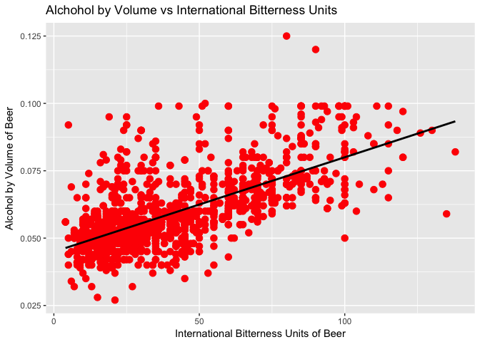

### Introduction

In the late 1970s the United States began a renaissance of craft brewing that would turn into a national phenomenon. In 2017 there was recorded a total of over 6,000 breweries and it is estimated that 83% of 21+ adults now live within 10 miles of a brewery. The industry was measured as contributing 67.8 billion dollars to the U.S. economy in 2016. The code below begins with a raw data dump of prominenet breweries and beers with the goal of analysis. As shown in the initial data exploration, the data is not entirely clean. However, once the data has been appropriately cleaned meaningful insight can be gleaned.


### Initial Review and Cleanup

From initial review of the information provided we will show how many breweries are present within each state.


```r
library(stringr)
library(tidyverse)
library(ggplot2)
```


```r
Breweries <- read.csv("Breweries.csv", header=TRUE, sep = ',', stringsAsFactors = FALSE)

# Check City spelling
Breweries <- Breweries[with(Breweries, order(State,City,Name)),]

BreweriesClean <- Breweries
BreweriesClean <- BreweriesClean[with(BreweriesClean, order(Brew_ID)),]

# Misspelled City Names, researched official spelling 
BreweriesClean[c(59,139),3] <- "Saint Paul" 
BreweriesClean[130,3] <- "St. Marys" 
BreweriesClean[68,3] <- "St. Petersburg" 
BreweriesClean[339,3] <- "St. Johns" 
BreweriesClean[c(378,457),3] <- "Menomonie" 
BreweriesClean[69,3] <- "Mount Airy" 
BreweriesClean[385,3] <- "Mount Pleasant" 

# Incorrect State for given City
BreweriesClean[96,4] <- "MI" 

# Check for duplicate Breweries after removing Brewery and Brewing Company
BreweriesClean$BrewDups = BreweriesClean$Name
  
# Remove "Brewery", "Brewing Company", "Brewing", "Beer Co.", 
BreweriesClean$BrewDups <- str_replace_all(BreweriesClean$BrewDups, "Brewery", "")
BreweriesClean$BrewDups <- str_replace_all(BreweriesClean$BrewDups, "Brewing", "")
BreweriesClean$BrewDups <- str_replace_all(BreweriesClean$BrewDups, "Beer", "")
BreweriesClean$BrewDups <- str_replace_all(BreweriesClean$BrewDups, "Cider", "")
BreweriesClean$BrewDups <- str_replace_all(BreweriesClean$BrewDups, "Company", "")
BreweriesClean$BrewDups <- str_replace_all(BreweriesClean$BrewDups, "co.", "")
BreweriesClean$BrewDups <- str_replace_all(BreweriesClean$BrewDups, " ", "")

# Convert all characters to lower so we can better find potential duplicates
BreweriesClean$BrewDups <- tolower(BreweriesClean$BrewDups)
# Paste Name converted to lower, City, and State for matching duplicates
BreweriesClean <- unite(BreweriesClean, BrewDupsFreq, BrewDups, City, State, sep = ",", remove = FALSE)

# Determine if multiples are present
dupNames <- as.data.frame(table(BreweriesClean$BrewDupsFreq))
dupNames <- subset(dupNames, dupNames$Freq>1)

BreweriesCleanDups <- BreweriesClean[BreweriesClean$BrewDupsFreq %in%  dupNames$Var1,]
BreweriesCleanDups <- BreweriesCleanDups[order(BreweriesCleanDups$BrewDupsFreq),]

# Review results
BreweriesCleanDups
```

```
##     Brew_ID                         Name                   BrewDupsFreq
## 2         2    Against the Grain Brewery againstthegrain,Louisville, KY
## 63       63    Against The Grain Brewery againstthegrain,Louisville, KY
## 147     147                 Angry Minnow        angryminnow,Hayward, WI
## 543     543 Angry Minnow Brewing Company        angryminnow,Hayward, WI
## 89       89 Goose Island Brewing Company        gooseisland,Chicago, IL
## 197     197 Goose Island Brewery Company        gooseisland,Chicago, IL
## 378     378      Lucette Brewing Company          lucette,Menomonie, WI
## 457     457      Lucette Brewing Company          lucette,Menomonie, WI
## 59       59       Summit Brewing Company          summit,Saint Paul, MN
## 139     139       Summit Brewing Company          summit,Saint Paul, MN
##           City State        BrewDups
## 2   Louisville    KY againstthegrain
## 63  Louisville    KY againstthegrain
## 147    Hayward    WI     angryminnow
## 543    Hayward    WI     angryminnow
## 89     Chicago    IL     gooseisland
## 197    Chicago    IL     gooseisland
## 378  Menomonie    WI         lucette
## 457  Menomonie    WI         lucette
## 59  Saint Paul    MN          summit
## 139 Saint Paul    MN          summit
```

```r
# Fix based on observations and other data discovery
BreweriesClean[2,2] <- "Against The Grain Brewery"
BreweriesClean[147,2] <- "Angrew Minnow Brewing Company"
BreweriesClean[197,2] <- "Goose Island Brewing Company"
BreweriesClean[380,2] <- "Grey Sail Brewing Company"
BreweriesClean[396,2] <- "Hops & Grains Brewing Company"

# Brew_ID with Duplicate Rows: 2 & 63, 89 & 197, 147 & 543, 378 & 457, 59 & 139
BreweriesClean$BrewDupsFreq <- NULL
BreweriesClean$BrewDups <- NULL
```

The code above performs several cleaning functions. First, city names are manually checked and updated in the data. Second, duplicates of breweries are revealed. This is done by removing common parts of brewery names, such as "Brewery" or "Company". Then the brewery name is added to city and state and each string is examined against all other strings. Finally, brewery names are manually updated.

### Question 1

How many breweries are present in each state?


```r
# Make use of cleaned data set
BreweryByState <- table(factor(BreweriesClean$State))
BreweryByState <- data.frame(BreweryByState)

# Rename columns to something meaningful
colnames(BreweryByState) <- c('State','Count')

BreweryByState
```

```
##    State Count
## 1     AK     7
## 2     AL     3
## 3     AR     2
## 4     AZ    11
## 5     CA    39
## 6     CO    47
## 7     CT     8
## 8     DC     1
## 9     DE     2
## 10    FL    15
## 11    GA     7
## 12    HI     4
## 13    IA     5
## 14    ID     5
## 15    IL    18
## 16    IN    22
## 17    KS     3
## 18    KY     4
## 19    LA     5
## 20    MA    22
## 21    MD     7
## 22    ME     9
## 23    MI    32
## 24    MN    12
## 25    MO     9
## 26    MS     2
## 27    MT     9
## 28    NC    19
## 29    ND     1
## 30    NE     5
## 31    NH     3
## 32    NJ     3
## 33    NM     4
## 34    NV     2
## 35    NY    16
## 36    OH    15
## 37    OK     6
## 38    OR    29
## 39    PA    25
## 40    RI     5
## 41    SC     4
## 42    SD     1
## 43    TN     3
## 44    TX    28
## 45    UT     4
## 46    VA    16
## 47    VT    10
## 48    WA    23
## 49    WI    20
## 50    WV     1
## 51    WY     4
## 52    MI     1
```

The code above counts the number of breweries in each state and creates a data frame. Finally, meaningful names are applied to the columns and the result is displayed on the screen.

### Question 2

Merge beer data with the breweries data. Print the first 6 observations and the last six observations to check the merged file.


```r
# Read in csv file containing Beer details
Beers <- read.csv("Beers.csv", header=TRUE, sep = ',')

# Merge the data on Beers.Brewery_Id and Breweries.Brew_ _ID then validate merged file
df_merge <- merge(Beers, Breweries, by.x="Brewery_id", by.y = "Brew_ID")
head(df_merge)
```

```
##   Brewery_id        Name.x Beer_ID   ABV IBU
## 1          1  Get Together    2692 0.045  50
## 2          1 Maggie's Leap    2691 0.049  26
## 3          1    Wall's End    2690 0.048  19
## 4          1       Pumpion    2689 0.060  38
## 5          1    Stronghold    2688 0.060  25
## 6          1   Parapet ESB    2687 0.056  47
##                                 Style Ounces             Name.y
## 1                        American IPA     16 NorthGate Brewing 
## 2                  Milk / Sweet Stout     16 NorthGate Brewing 
## 3                   English Brown Ale     16 NorthGate Brewing 
## 4                         Pumpkin Ale     16 NorthGate Brewing 
## 5                     American Porter     16 NorthGate Brewing 
## 6 Extra Special / Strong Bitter (ESB)     16 NorthGate Brewing 
##          City State
## 1 Minneapolis    MN
## 2 Minneapolis    MN
## 3 Minneapolis    MN
## 4 Minneapolis    MN
## 5 Minneapolis    MN
## 6 Minneapolis    MN
```

```r
tail(df_merge)
```

```
##      Brewery_id                    Name.x Beer_ID   ABV IBU
## 2405        556             Pilsner Ukiah      98 0.055  NA
## 2406        557  Heinnieweisse Weissebier      52 0.049  NA
## 2407        557           Snapperhead IPA      51 0.068  NA
## 2408        557         Moo Thunder Stout      50 0.049  NA
## 2409        557         Porkslap Pale Ale      49 0.043  NA
## 2410        558 Urban Wilderness Pale Ale      30 0.049  NA
##                        Style Ounces                        Name.y
## 2405         German Pilsener     12         Ukiah Brewing Company
## 2406              Hefeweizen     12       Butternuts Beer and Ale
## 2407            American IPA     12       Butternuts Beer and Ale
## 2408      Milk / Sweet Stout     12       Butternuts Beer and Ale
## 2409 American Pale Ale (APA)     12       Butternuts Beer and Ale
## 2410        English Pale Ale     12 Sleeping Lady Brewing Company
##               City State
## 2405         Ukiah    CA
## 2406 Garrattsville    NY
## 2407 Garrattsville    NY
## 2408 Garrattsville    NY
## 2409 Garrattsville    NY
## 2410     Anchorage    AK
```

```r
#Give the columns more meaningful name
# Rename column 'Name' from Beers data
colnames(df_merge)[2] <- "Beer_name"

# Rename column 'Name' from Breweries data
colnames(df_merge)[8] <- "Brewery_name"
names(df_merge)
```

```
##  [1] "Brewery_id"   "Beer_name"    "Beer_ID"      "ABV"         
##  [5] "IBU"          "Style"        "Ounces"       "Brewery_name"
##  [9] "City"         "State"
```

```r
#Arrange the columns in more meaningful order
df_merge <- df_merge[c("Brewery_id","Brewery_name","Beer_ID","Beer_name",
                       "ABV","IBU","Style","Ounces", "City","State")]


# Show first 6 and last 6 rows of merged data
head(df_merge,6)
```

```
##   Brewery_id       Brewery_name Beer_ID     Beer_name   ABV IBU
## 1          1 NorthGate Brewing     2692  Get Together 0.045  50
## 2          1 NorthGate Brewing     2691 Maggie's Leap 0.049  26
## 3          1 NorthGate Brewing     2690    Wall's End 0.048  19
## 4          1 NorthGate Brewing     2689       Pumpion 0.060  38
## 5          1 NorthGate Brewing     2688    Stronghold 0.060  25
## 6          1 NorthGate Brewing     2687   Parapet ESB 0.056  47
##                                 Style Ounces        City State
## 1                        American IPA     16 Minneapolis    MN
## 2                  Milk / Sweet Stout     16 Minneapolis    MN
## 3                   English Brown Ale     16 Minneapolis    MN
## 4                         Pumpkin Ale     16 Minneapolis    MN
## 5                     American Porter     16 Minneapolis    MN
## 6 Extra Special / Strong Bitter (ESB)     16 Minneapolis    MN
```

```r
tail(df_merge,6)
```

```
##      Brewery_id                  Brewery_name Beer_ID
## 2405        556         Ukiah Brewing Company      98
## 2406        557       Butternuts Beer and Ale      52
## 2407        557       Butternuts Beer and Ale      51
## 2408        557       Butternuts Beer and Ale      50
## 2409        557       Butternuts Beer and Ale      49
## 2410        558 Sleeping Lady Brewing Company      30
##                      Beer_name   ABV IBU                   Style Ounces
## 2405             Pilsner Ukiah 0.055  NA         German Pilsener     12
## 2406  Heinnieweisse Weissebier 0.049  NA              Hefeweizen     12
## 2407           Snapperhead IPA 0.068  NA            American IPA     12
## 2408         Moo Thunder Stout 0.049  NA      Milk / Sweet Stout     12
## 2409         Porkslap Pale Ale 0.043  NA American Pale Ale (APA)     12
## 2410 Urban Wilderness Pale Ale 0.049  NA        English Pale Ale     12
##               City State
## 2405         Ukiah    CA
## 2406 Garrattsville    NY
## 2407 Garrattsville    NY
## 2408 Garrattsville    NY
## 2409 Garrattsville    NY
## 2410     Anchorage    AK
```

The code above is used to combine the beer and brewery data on a common identifier present in both data sets - the "Brewery_id" in the beer dataset and the "Brew_ID" in the breweries dataset. Once the datasets are combined a more meaningul name is applied to some of the columns and the order is changed placing the identifiers in more logical positions.

Finally, the first and last six rows are shown.

### Question 3

Report the number of NA’s in each column.


```r
CountNA <- colSums(is.na(df_merge))
CountNA <- data.frame(CountNA)
CountNA
```

```
##              CountNA
## Brewery_id         0
## Brewery_name       0
## Beer_ID            0
## Beer_name          0
## ABV               62
## IBU             1005
## Style              0
## Ounces             0
## City               0
## State              0
```

The above code counts the number of NAs in each column. The only features with NAs are ABV with 62 and IBU with 1005.

### Question 4

Compute the median alcohol content and international bitterness unit for each state. Plot a bar chart to compare.


```r
# Generate the median of alcohol content and international bitterness unit for each State
df_merge_ABV <- na.omit(data.frame(State=df_merge$State, ABV=df_merge$ABV)) # Remove NA values
df_merge_IBU <- na.omit(data.frame(State=df_merge$State, IBU=df_merge$IBU)) # Remove NA values
 
MedianABV <- tapply(df_merge_ABV$ABV,df_merge_ABV$State,median)
MedianIBU <- tapply(df_merge_IBU$IBU,df_merge_IBU$State,median)

MedianABV <- as.data.frame(MedianABV)
MedianABV$State <- rownames(MedianABV)
rownames(MedianABV) <- NULL
MedianABV$State <- factor(MedianABV$State, levels = MedianABV[order(MedianABV$MedianABV), "State"])

MedianIBU <- as.data.frame(MedianIBU)
MedianIBU$State <- rownames(MedianIBU)
rownames(MedianIBU) <- NULL
MedianIBU <- na.omit(MedianIBU) # SD had 1 value, the median function generated a null
MedianIBU$State <- factor(MedianIBU$State, levels = MedianIBU[order(MedianIBU$MedianIBU), "State"])

# Plot MedianABV by State
ggplot(data=MedianABV, aes(x=State, y=MedianABV)) +
  geom_bar(stat='identity', color='black', fill='light blue') +
  ylab("MedianABV") + xlab("State") +
  ggtitle("MedianABV by State") +
  coord_flip()
```


```r
# Plot MedianIBU by State  
ggplot(data=MedianIBU, aes(x=State, y=MedianIBU)) +
  geom_bar(stat='identity', color='black', fill='light green') +
  ylab("MedianIBU") + xlab("State") +
  ggtitle("MedianIBU by State") + 
  coord_flip()
```


The code above applies the median function to ABV and IBU that have been subset by State and saves it into a new object. The calculated median ABV and IBU are then added to a common data frame with State for plotting. Finally, plots are produced for median IBU and ABV by State.

### Question 5

Which state has the maximum alcoholic (ABV) beer? Which state has the most bitter (IBU) beer?


```r
# Sort data to determine State with highest ABV
# Largest ABV is .125 within Colorado
TopABV <- df_merge[order(-df_merge$ABV),]
TopABV <- TopABV[1,c(5,10)]
TopABV
```

```
##       ABV State
## 375 0.128    CO
```

```r
# Sort data to determine State with highest IBU
# Largest IBU is 138 within Oregon
TopIBU <- df_merge[order(-df_merge$IBU),]
TopIBU <- TopIBU[1,c(6,10)]
TopIBU
```

```
##      IBU State
## 1857 138    OR
```

### Question 6

The following shows the summary statistics of the ABV variable.


```r
summaryABV <- summary(df_merge$ABV)
summaryABV
```

```
##    Min. 1st Qu.  Median    Mean 3rd Qu.    Max.    NA's 
## 0.00100 0.05000 0.05600 0.05977 0.06700 0.12800      62
```

The code above produces the summary statistics for the ABV variable.

### Question 7

Is there an apparent relationship between the bitterness of the beer and its alcoholic content? Draw a scatter plot.


```r
cor(df_merge$IBU, df_merge$ABV, use = "complete.obs")
```

```
## [1] 0.6706215
```

```r
ggplot(data=na.omit(df_merge), aes(x=IBU, y=ABV)) + 
  geom_point(color = "red", size = 3)+
  geom_smooth(method=lm, se = FALSE, color = "black") +
  labs(x="International Bitterness Units of Beer", y="Alcohol by Volume of Beer") + 
  ggtitle("Alchohol by Volume vs International Bitterness Units")
```



The code above computes the correlation between IBU and IBV and displays it to the screen. Finally, a plot is drawn with IBU on the x-axis and ABV on the y-axis.

Yes. As made apparent by the black line in the plot above there appears to be a linear relationship between the IBU and ABV of the beers in the data. Further evidence is revealed by the correlation coeffecient of .6706.
