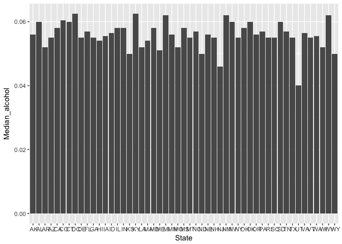
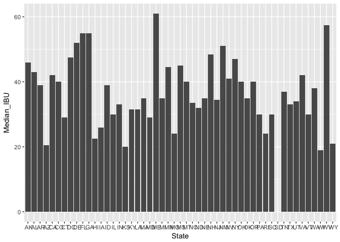
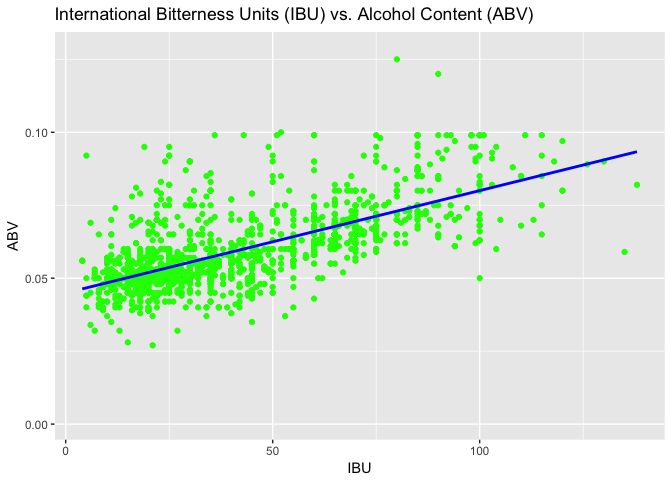

#Questions

```r
library(dplyr)
```

```
## 
## Attaching package: 'dplyr'
```

```
## The following objects are masked from 'package:stats':
## 
##     filter, lag
```

```
## The following objects are masked from 'package:base':
## 
##     intersect, setdiff, setequal, union
```

```r
library(ggplot2)

#read in csv files and normalize column names
Beers <- read.csv("Beers.csv", sep = ",")
colnames(Beers) <- c("Name", "Beer_id", "ABV", "IBU", "Brewery_id", "Style", "Ounces")

Breweries <- read.csv("Breweries.csv", sep = ",")
colnames(Breweries) <- c("Brewery_id", "Name", "City", "State")

# a. How many breweries in each state?
summary(Breweries)
```

```
##    Brewery_id                         Name           City    
##  Min.   :  1.0   Blackrocks Brewery     :  2   Portland: 17  
##  1st Qu.:140.2   Blue Mountain Brewery  :  2   Boulder :  9  
##  Median :279.5   Lucette Brewing Company:  2   Chicago :  9  
##  Mean   :279.5   Oskar Blues Brewery    :  2   Seattle :  9  
##  3rd Qu.:418.8   Otter Creek Brewing    :  2   Austin  :  8  
##  Max.   :558.0   Sly Fox Brewing Company:  2   Denver  :  8  
##                  (Other)                :546   (Other) :498  
##      State    
##   CO    : 47  
##   CA    : 39  
##   MI    : 32  
##   OR    : 29  
##   TX    : 28  
##   PA    : 25  
##  (Other):358
```

```r
table(Breweries$State)
```

```
## 
##  AK  AL  AR  AZ  CA  CO  CT  DC  DE  FL  GA  HI  IA  ID  IL  IN  KS  KY 
##   7   3   2  11  39  47   8   1   2  15   7   4   5   5  18  22   3   4 
##  LA  MA  MD  ME  MI  MN  MO  MS  MT  NC  ND  NE  NH  NJ  NM  NV  NY  OH 
##   5  23   7   9  32  12   9   2   9  19   1   5   3   3   4   2  16  15 
##  OK  OR  PA  RI  SC  SD  TN  TX  UT  VA  VT  WA  WI  WV  WY 
##   6  29  25   5   4   1   3  28   4  16  10  23  20   1   4
```

```r
# b. Merge beer data with the breweries data. Print the first 6 observations and the last six observations to check the merged file
brewDataMerged <- merge(Beers, Breweries, by = "Brewery_id", all = TRUE)
colnames(brewDataMerged) <- c("Brewery_id", "Beer_name", "Beer_id", "ABV", "IBU", "Style", "Ounces", "Brewery_name", "City", "State")
head(brewDataMerged, 6)
```

```
##   Brewery_id     Beer_name Beer_id   ABV IBU
## 1          1  Get Together    2692 0.045  50
## 2          1 Maggie's Leap    2691 0.049  26
## 3          1    Wall's End    2690 0.048  19
## 4          1       Pumpion    2689 0.060  38
## 5          1    Stronghold    2688 0.060  25
## 6          1   Parapet ESB    2687 0.056  47
##                                 Style Ounces       Brewery_name
## 1                        American IPA     16 NorthGate Brewing 
## 2                  Milk / Sweet Stout     16 NorthGate Brewing 
## 3                   English Brown Ale     16 NorthGate Brewing 
## 4                         Pumpkin Ale     16 NorthGate Brewing 
## 5                     American Porter     16 NorthGate Brewing 
## 6 Extra Special / Strong Bitter (ESB)     16 NorthGate Brewing 
##          City State
## 1 Minneapolis    MN
## 2 Minneapolis    MN
## 3 Minneapolis    MN
## 4 Minneapolis    MN
## 5 Minneapolis    MN
## 6 Minneapolis    MN
```

```r
tail(brewDataMerged, 6)
```

```
##      Brewery_id                 Beer_name Beer_id   ABV IBU
## 2405        556             Pilsner Ukiah      98 0.055  NA
## 2406        557  Heinnieweisse Weissebier      52 0.049  NA
## 2407        557           Snapperhead IPA      51 0.068  NA
## 2408        557         Moo Thunder Stout      50 0.049  NA
## 2409        557         Porkslap Pale Ale      49 0.043  NA
## 2410        558 Urban Wilderness Pale Ale      30 0.049  NA
##                        Style Ounces                  Brewery_name
## 2405         German Pilsener     12         Ukiah Brewing Company
## 2406              Hefeweizen     12       Butternuts Beer and Ale
## 2407            American IPA     12       Butternuts Beer and Ale
## 2408      Milk / Sweet Stout     12       Butternuts Beer and Ale
## 2409 American Pale Ale (APA)     12       Butternuts Beer and Ale
## 2410        English Pale Ale     12 Sleeping Lady Brewing Company
##               City State
## 2405         Ukiah    CA
## 2406 Garrattsville    NY
## 2407 Garrattsville    NY
## 2408 Garrattsville    NY
## 2409 Garrattsville    NY
## 2410     Anchorage    AK
```

```r
# c. Report the number of NA's in Each Column
sapply(brewDataMerged, function(x) sum(length(which(is.na(x)))))
```

```
##   Brewery_id    Beer_name      Beer_id          ABV          IBU 
##            0            0            0           62         1005 
##        Style       Ounces Brewery_name         City        State 
##            0            0            0            0            0
```

```r
# d. Compute the median alcohol content and international bitterness unit for each state. Plot a bar chart to compare.
stateGrouped <- group_by(brewDataMerged, State)
summarizedGroup <- summarize(stateGrouped, Median_alcohol = median(ABV, na.rm = TRUE), Median_IBU = median(IBU, na.rm = TRUE))
ggplot(data = summarizedGroup) + geom_bar(mapping = aes(x= State, y= Median_alcohol), stat="identity")
```

<!-- -->

```r
ggplot(data = summarizedGroup) + geom_bar(mapping = aes(x= State, y= Median_IBU), stat="identity")
```

```
## Warning: Removed 1 rows containing missing values (position_stack).
```

<!-- -->

```r
# e.
#state with most alcoholic beer?
brewDataMerged[which.max(brewDataMerged$ABV),]
```

```
##     Brewery_id                                            Beer_name
## 375         52 Lee Hill Series Vol. 5 - Belgian Style Quadrupel Ale
##     Beer_id   ABV IBU            Style Ounces            Brewery_name
## 375    2565 0.128  NA Quadrupel (Quad)   19.2 Upslope Brewing Company
##        City State
## 375 Boulder    CO
```

```r
#state witb most bitter beer
brewDataMerged[which.max(brewDataMerged$IBU),]
```

```
##      Brewery_id                 Beer_name Beer_id   ABV IBU
## 1857        375 Bitter Bitch Imperial IPA     980 0.082 138
##                               Style Ounces            Brewery_name    City
## 1857 American Double / Imperial IPA     12 Astoria Brewing Company Astoria
##      State
## 1857    OR
```

```r
#f. summary for ABV statistic
summary(brewDataMerged$ABV)
```

```
##    Min. 1st Qu.  Median    Mean 3rd Qu.    Max.    NA's 
## 0.00100 0.05000 0.05600 0.05977 0.06700 0.12800      62
```

```r
#g. relationship between the bitterness of the beer and its alcoholic content? Draw a scatter plot.
ggplot(brewDataMerged, aes(IBU, ABV))+ 
  ggtitle("International Bitterness Units (IBU) vs. Alcohol Content (ABV)") +
  geom_point(color="green") + 
  geom_smooth(method=lm,  se=FALSE, color="blue")
```

```
## Warning: Removed 1005 rows containing non-finite values (stat_smooth).
```

```
## Warning: Removed 1005 rows containing missing values (geom_point).
```

<!-- -->
