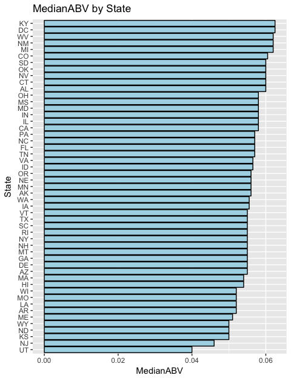
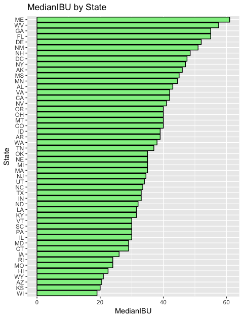
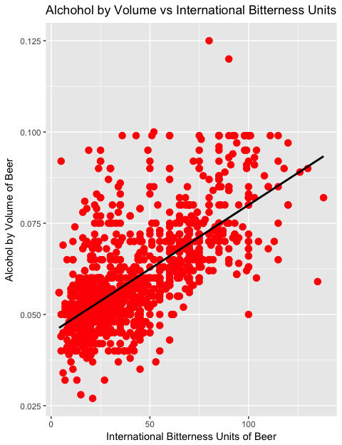

### Introduction

In the late 1970s the United States began a renaissance of craft brewing that would turn into a national phenomenon. In 2017 there was recorded a total of over 6,000 breweries and it is estimated that 83% of 21+ adults now live within 10 miles of a brewery. The industry was measured as contributing 67.8 billion dollars to the U.S. economy in 2016. The code below begins with a raw data dump of prominenet breweries and beers with the goal of analysis. As shown in the initial data exploration, the data is not entirely clean. However, once the data has been appropriately cleaned meaningful insight can be gleaned.


### Initial Review and Cleanup

From initial review of the information provided we will show how many breweries are present within each state.


```r
library(stringr)
library(tidyverse)
library(ggplot2)
library(kableExtra)
```


```r
Breweries <- read.csv("Breweries.csv", header=TRUE, sep = ',', stringsAsFactors = FALSE)

# Check City spelling
Breweries <- Breweries[with(Breweries, order(State,City,Name)),]

BreweriesClean <- Breweries
BreweriesClean <- BreweriesClean[with(BreweriesClean, order(Brew_ID)),]

# Misspelled City Names, researched official spelling 
BreweriesClean[c(59,139),3] <- "Saint Paul" 
BreweriesClean[130,3] <- "St. Marys" 
BreweriesClean[68,3] <- "St. Petersburg" 
BreweriesClean[339,3] <- "St. Johns" 
BreweriesClean[c(378,457),3] <- "Menomonie" 
BreweriesClean[69,3] <- "Mount Airy" 
BreweriesClean[385,3] <- "Mount Pleasant" 

# Incorrect State for given City
BreweriesClean[96,4] <- "MI" 

# Check for duplicate Breweries after removing Brewery and Brewing Company
BreweriesClean$BrewDups = BreweriesClean$Name
  
# Remove "Brewery", "Brewing Company", "Brewing", "Beer Co.", 
BreweriesClean$BrewDups <- str_replace_all(BreweriesClean$BrewDups, "Brewery", "")
BreweriesClean$BrewDups <- str_replace_all(BreweriesClean$BrewDups, "Brewing", "")
BreweriesClean$BrewDups <- str_replace_all(BreweriesClean$BrewDups, "Beer", "")
BreweriesClean$BrewDups <- str_replace_all(BreweriesClean$BrewDups, "Cider", "")
BreweriesClean$BrewDups <- str_replace_all(BreweriesClean$BrewDups, "Company", "")
BreweriesClean$BrewDups <- str_replace_all(BreweriesClean$BrewDups, "co.", "")
BreweriesClean$BrewDups <- str_replace_all(BreweriesClean$BrewDups, " ", "")

# Convert all characters to lower so we can better find potential duplicates
BreweriesClean$BrewDups <- tolower(BreweriesClean$BrewDups)
# Paste Name converted to lower, City, and State for matching duplicates
BreweriesClean <- unite(BreweriesClean, BrewDupsFreq, BrewDups, City, State, sep = ",", remove = FALSE)

# Determine if multiples are present
dupNames <- as.data.frame(table(BreweriesClean$BrewDupsFreq))
dupNames <- subset(dupNames, dupNames$Freq>1)

BreweriesCleanDups <- BreweriesClean[BreweriesClean$BrewDupsFreq %in%  dupNames$Var1,]
BreweriesCleanDups <- BreweriesCleanDups[order(BreweriesCleanDups$BrewDupsFreq),]

# Review results
knitr::kable(BreweriesCleanDups,caption = "Potential Duplicates", row.names = FALSE, "html") %>%
  kable_styling(bootstrap_options = c("striped","hover","condensed"))
```

<table class="table table-striped table-hover table-condensed" style="margin-left: auto; margin-right: auto;">
<caption>Potential Duplicates</caption>
 <thead>
  <tr>
   <th style="text-align:right;"> Brew_ID </th>
   <th style="text-align:left;"> Name </th>
   <th style="text-align:left;"> BrewDupsFreq </th>
   <th style="text-align:left;"> City </th>
   <th style="text-align:left;"> State </th>
   <th style="text-align:left;"> BrewDups </th>
  </tr>
 </thead>
<tbody>
  <tr>
   <td style="text-align:right;"> 2 </td>
   <td style="text-align:left;"> Against the Grain Brewery </td>
   <td style="text-align:left;"> againstthegrain,Louisville, KY </td>
   <td style="text-align:left;"> Louisville </td>
   <td style="text-align:left;"> KY </td>
   <td style="text-align:left;"> againstthegrain </td>
  </tr>
  <tr>
   <td style="text-align:right;"> 63 </td>
   <td style="text-align:left;"> Against The Grain Brewery </td>
   <td style="text-align:left;"> againstthegrain,Louisville, KY </td>
   <td style="text-align:left;"> Louisville </td>
   <td style="text-align:left;"> KY </td>
   <td style="text-align:left;"> againstthegrain </td>
  </tr>
  <tr>
   <td style="text-align:right;"> 147 </td>
   <td style="text-align:left;"> Angry Minnow </td>
   <td style="text-align:left;"> angryminnow,Hayward, WI </td>
   <td style="text-align:left;"> Hayward </td>
   <td style="text-align:left;"> WI </td>
   <td style="text-align:left;"> angryminnow </td>
  </tr>
  <tr>
   <td style="text-align:right;"> 543 </td>
   <td style="text-align:left;"> Angry Minnow Brewing Company </td>
   <td style="text-align:left;"> angryminnow,Hayward, WI </td>
   <td style="text-align:left;"> Hayward </td>
   <td style="text-align:left;"> WI </td>
   <td style="text-align:left;"> angryminnow </td>
  </tr>
  <tr>
   <td style="text-align:right;"> 89 </td>
   <td style="text-align:left;"> Goose Island Brewing Company </td>
   <td style="text-align:left;"> gooseisland,Chicago, IL </td>
   <td style="text-align:left;"> Chicago </td>
   <td style="text-align:left;"> IL </td>
   <td style="text-align:left;"> gooseisland </td>
  </tr>
  <tr>
   <td style="text-align:right;"> 197 </td>
   <td style="text-align:left;"> Goose Island Brewery Company </td>
   <td style="text-align:left;"> gooseisland,Chicago, IL </td>
   <td style="text-align:left;"> Chicago </td>
   <td style="text-align:left;"> IL </td>
   <td style="text-align:left;"> gooseisland </td>
  </tr>
  <tr>
   <td style="text-align:right;"> 378 </td>
   <td style="text-align:left;"> Lucette Brewing Company </td>
   <td style="text-align:left;"> lucette,Menomonie, WI </td>
   <td style="text-align:left;"> Menomonie </td>
   <td style="text-align:left;"> WI </td>
   <td style="text-align:left;"> lucette </td>
  </tr>
  <tr>
   <td style="text-align:right;"> 457 </td>
   <td style="text-align:left;"> Lucette Brewing Company </td>
   <td style="text-align:left;"> lucette,Menomonie, WI </td>
   <td style="text-align:left;"> Menomonie </td>
   <td style="text-align:left;"> WI </td>
   <td style="text-align:left;"> lucette </td>
  </tr>
  <tr>
   <td style="text-align:right;"> 59 </td>
   <td style="text-align:left;"> Summit Brewing Company </td>
   <td style="text-align:left;"> summit,Saint Paul, MN </td>
   <td style="text-align:left;"> Saint Paul </td>
   <td style="text-align:left;"> MN </td>
   <td style="text-align:left;"> summit </td>
  </tr>
  <tr>
   <td style="text-align:right;"> 139 </td>
   <td style="text-align:left;"> Summit Brewing Company </td>
   <td style="text-align:left;"> summit,Saint Paul, MN </td>
   <td style="text-align:left;"> Saint Paul </td>
   <td style="text-align:left;"> MN </td>
   <td style="text-align:left;"> summit </td>
  </tr>
</tbody>
</table>

```r
# Fix based on observations and other data discovery
BreweriesClean[2,2] <- "Against The Grain Brewery"
BreweriesClean[147,2] <- "Angrew Minnow Brewing Company"
BreweriesClean[197,2] <- "Goose Island Brewing Company"
BreweriesClean[380,2] <- "Grey Sail Brewing Company"
BreweriesClean[396,2] <- "Hops & Grains Brewing Company"

# Brew_ID with Duplicate Rows: 2 & 63, 89 & 197, 147 & 543, 378 & 457, 59 & 139
BreweriesClean$BrewDupsFreq <- NULL
BreweriesClean$BrewDups <- NULL
```

The code above performs several cleaning functions. First, city names are manually checked and updated in the data. Second, duplicates of breweries are revealed. This is done by removing common parts of brewery names, such as "Brewery" or "Company". Then the brewery name is added to city and state and each string is examined against all other strings. Finally, brewery names are manually updated.

### Question 1

How many breweries are present in each state?


```r
# Make use of cleaned data set
BreweryByState <- table(factor(BreweriesClean$State))
BreweryByState <- data.frame(BreweryByState)

# Rename columns to something meaningful
colnames(BreweryByState) <- c('State','Count')

knitr::kable(BreweryByState,caption = "Breweries by State",  "html") %>%
  kable_styling(full_width = F, position = "center", bootstrap_options = c("striped","hover","condensed")) %>%
  column_spec(1, bold = T, width = "1in") %>%
  column_spec(2, width = "1in") %>%
  scroll_box(width = "2in", height = "6in")
```

<div style="border: 1px solid #ddd; padding: 5px; overflow-y: scroll; height:6in; overflow-x: scroll; width:2in; "><table class="table table-striped table-hover table-condensed" style="width: auto !important; margin-left: auto; margin-right: auto;">
<caption>Breweries by State</caption>
 <thead>
  <tr>
   <th style="text-align:left;"> State </th>
   <th style="text-align:right;"> Count </th>
  </tr>
 </thead>
<tbody>
  <tr>
   <td style="text-align:left;width: 1in; font-weight: bold;"> AK </td>
   <td style="text-align:right;width: 1in; "> 7 </td>
  </tr>
  <tr>
   <td style="text-align:left;width: 1in; font-weight: bold;"> AL </td>
   <td style="text-align:right;width: 1in; "> 3 </td>
  </tr>
  <tr>
   <td style="text-align:left;width: 1in; font-weight: bold;"> AR </td>
   <td style="text-align:right;width: 1in; "> 2 </td>
  </tr>
  <tr>
   <td style="text-align:left;width: 1in; font-weight: bold;"> AZ </td>
   <td style="text-align:right;width: 1in; "> 11 </td>
  </tr>
  <tr>
   <td style="text-align:left;width: 1in; font-weight: bold;"> CA </td>
   <td style="text-align:right;width: 1in; "> 39 </td>
  </tr>
  <tr>
   <td style="text-align:left;width: 1in; font-weight: bold;"> CO </td>
   <td style="text-align:right;width: 1in; "> 47 </td>
  </tr>
  <tr>
   <td style="text-align:left;width: 1in; font-weight: bold;"> CT </td>
   <td style="text-align:right;width: 1in; "> 8 </td>
  </tr>
  <tr>
   <td style="text-align:left;width: 1in; font-weight: bold;"> DC </td>
   <td style="text-align:right;width: 1in; "> 1 </td>
  </tr>
  <tr>
   <td style="text-align:left;width: 1in; font-weight: bold;"> DE </td>
   <td style="text-align:right;width: 1in; "> 2 </td>
  </tr>
  <tr>
   <td style="text-align:left;width: 1in; font-weight: bold;"> FL </td>
   <td style="text-align:right;width: 1in; "> 15 </td>
  </tr>
  <tr>
   <td style="text-align:left;width: 1in; font-weight: bold;"> GA </td>
   <td style="text-align:right;width: 1in; "> 7 </td>
  </tr>
  <tr>
   <td style="text-align:left;width: 1in; font-weight: bold;"> HI </td>
   <td style="text-align:right;width: 1in; "> 4 </td>
  </tr>
  <tr>
   <td style="text-align:left;width: 1in; font-weight: bold;"> IA </td>
   <td style="text-align:right;width: 1in; "> 5 </td>
  </tr>
  <tr>
   <td style="text-align:left;width: 1in; font-weight: bold;"> ID </td>
   <td style="text-align:right;width: 1in; "> 5 </td>
  </tr>
  <tr>
   <td style="text-align:left;width: 1in; font-weight: bold;"> IL </td>
   <td style="text-align:right;width: 1in; "> 18 </td>
  </tr>
  <tr>
   <td style="text-align:left;width: 1in; font-weight: bold;"> IN </td>
   <td style="text-align:right;width: 1in; "> 22 </td>
  </tr>
  <tr>
   <td style="text-align:left;width: 1in; font-weight: bold;"> KS </td>
   <td style="text-align:right;width: 1in; "> 3 </td>
  </tr>
  <tr>
   <td style="text-align:left;width: 1in; font-weight: bold;"> KY </td>
   <td style="text-align:right;width: 1in; "> 4 </td>
  </tr>
  <tr>
   <td style="text-align:left;width: 1in; font-weight: bold;"> LA </td>
   <td style="text-align:right;width: 1in; "> 5 </td>
  </tr>
  <tr>
   <td style="text-align:left;width: 1in; font-weight: bold;"> MA </td>
   <td style="text-align:right;width: 1in; "> 22 </td>
  </tr>
  <tr>
   <td style="text-align:left;width: 1in; font-weight: bold;"> MD </td>
   <td style="text-align:right;width: 1in; "> 7 </td>
  </tr>
  <tr>
   <td style="text-align:left;width: 1in; font-weight: bold;"> ME </td>
   <td style="text-align:right;width: 1in; "> 9 </td>
  </tr>
  <tr>
   <td style="text-align:left;width: 1in; font-weight: bold;"> MI </td>
   <td style="text-align:right;width: 1in; "> 32 </td>
  </tr>
  <tr>
   <td style="text-align:left;width: 1in; font-weight: bold;"> MN </td>
   <td style="text-align:right;width: 1in; "> 12 </td>
  </tr>
  <tr>
   <td style="text-align:left;width: 1in; font-weight: bold;"> MO </td>
   <td style="text-align:right;width: 1in; "> 9 </td>
  </tr>
  <tr>
   <td style="text-align:left;width: 1in; font-weight: bold;"> MS </td>
   <td style="text-align:right;width: 1in; "> 2 </td>
  </tr>
  <tr>
   <td style="text-align:left;width: 1in; font-weight: bold;"> MT </td>
   <td style="text-align:right;width: 1in; "> 9 </td>
  </tr>
  <tr>
   <td style="text-align:left;width: 1in; font-weight: bold;"> NC </td>
   <td style="text-align:right;width: 1in; "> 19 </td>
  </tr>
  <tr>
   <td style="text-align:left;width: 1in; font-weight: bold;"> ND </td>
   <td style="text-align:right;width: 1in; "> 1 </td>
  </tr>
  <tr>
   <td style="text-align:left;width: 1in; font-weight: bold;"> NE </td>
   <td style="text-align:right;width: 1in; "> 5 </td>
  </tr>
  <tr>
   <td style="text-align:left;width: 1in; font-weight: bold;"> NH </td>
   <td style="text-align:right;width: 1in; "> 3 </td>
  </tr>
  <tr>
   <td style="text-align:left;width: 1in; font-weight: bold;"> NJ </td>
   <td style="text-align:right;width: 1in; "> 3 </td>
  </tr>
  <tr>
   <td style="text-align:left;width: 1in; font-weight: bold;"> NM </td>
   <td style="text-align:right;width: 1in; "> 4 </td>
  </tr>
  <tr>
   <td style="text-align:left;width: 1in; font-weight: bold;"> NV </td>
   <td style="text-align:right;width: 1in; "> 2 </td>
  </tr>
  <tr>
   <td style="text-align:left;width: 1in; font-weight: bold;"> NY </td>
   <td style="text-align:right;width: 1in; "> 16 </td>
  </tr>
  <tr>
   <td style="text-align:left;width: 1in; font-weight: bold;"> OH </td>
   <td style="text-align:right;width: 1in; "> 15 </td>
  </tr>
  <tr>
   <td style="text-align:left;width: 1in; font-weight: bold;"> OK </td>
   <td style="text-align:right;width: 1in; "> 6 </td>
  </tr>
  <tr>
   <td style="text-align:left;width: 1in; font-weight: bold;"> OR </td>
   <td style="text-align:right;width: 1in; "> 29 </td>
  </tr>
  <tr>
   <td style="text-align:left;width: 1in; font-weight: bold;"> PA </td>
   <td style="text-align:right;width: 1in; "> 25 </td>
  </tr>
  <tr>
   <td style="text-align:left;width: 1in; font-weight: bold;"> RI </td>
   <td style="text-align:right;width: 1in; "> 5 </td>
  </tr>
  <tr>
   <td style="text-align:left;width: 1in; font-weight: bold;"> SC </td>
   <td style="text-align:right;width: 1in; "> 4 </td>
  </tr>
  <tr>
   <td style="text-align:left;width: 1in; font-weight: bold;"> SD </td>
   <td style="text-align:right;width: 1in; "> 1 </td>
  </tr>
  <tr>
   <td style="text-align:left;width: 1in; font-weight: bold;"> TN </td>
   <td style="text-align:right;width: 1in; "> 3 </td>
  </tr>
  <tr>
   <td style="text-align:left;width: 1in; font-weight: bold;"> TX </td>
   <td style="text-align:right;width: 1in; "> 28 </td>
  </tr>
  <tr>
   <td style="text-align:left;width: 1in; font-weight: bold;"> UT </td>
   <td style="text-align:right;width: 1in; "> 4 </td>
  </tr>
  <tr>
   <td style="text-align:left;width: 1in; font-weight: bold;"> VA </td>
   <td style="text-align:right;width: 1in; "> 16 </td>
  </tr>
  <tr>
   <td style="text-align:left;width: 1in; font-weight: bold;"> VT </td>
   <td style="text-align:right;width: 1in; "> 10 </td>
  </tr>
  <tr>
   <td style="text-align:left;width: 1in; font-weight: bold;"> WA </td>
   <td style="text-align:right;width: 1in; "> 23 </td>
  </tr>
  <tr>
   <td style="text-align:left;width: 1in; font-weight: bold;"> WI </td>
   <td style="text-align:right;width: 1in; "> 20 </td>
  </tr>
  <tr>
   <td style="text-align:left;width: 1in; font-weight: bold;"> WV </td>
   <td style="text-align:right;width: 1in; "> 1 </td>
  </tr>
  <tr>
   <td style="text-align:left;width: 1in; font-weight: bold;"> WY </td>
   <td style="text-align:right;width: 1in; "> 4 </td>
  </tr>
  <tr>
   <td style="text-align:left;width: 1in; font-weight: bold;"> MI </td>
   <td style="text-align:right;width: 1in; "> 1 </td>
  </tr>
</tbody>
</table></div>

The code above counts the number of breweries in each state and creates a data frame. Finally, meaningful names are applied to the columns and the result is displayed on the screen.

### Question 2

Merge beer data with the breweries data. Print the first 6 observations and the last six observations to check the merged file.


```r
# Read in csv file containing Beer details
Beers <- read.csv("Beers.csv", header=TRUE, sep = ',')

# Merge the data on Beers.Brewery_Id and Breweries.Brew_ID
df_merge <- merge(Beers, Breweries, by.x="Brewery_id", by.y = "Brew_ID")

# Give the columns more meaningful name
# Rename column 'Name' from Beers data
colnames(df_merge)[2] <- "Beer_name"

# Rename column 'Name' from Breweries data
colnames(df_merge)[8] <- "Brewery_name"

# Arrange the columns in more meaningful order
df_merge <- df_merge[c("Brewery_id","Brewery_name","Beer_ID","Beer_name",
                       "ABV","IBU","Style","Ounces", "City","State")]


# Show first 6 rows of merged data
head_merge = head(df_merge,6)
knitr::kable(head_merge,caption = "First 6 Rows",row.names = FALSE, "html") %>%
  kable_styling(bootstrap_options = c("striped","hover","condensed"))
```

<table class="table table-striped table-hover table-condensed" style="margin-left: auto; margin-right: auto;">
<caption>First 6 Rows</caption>
 <thead>
  <tr>
   <th style="text-align:right;"> Brewery_id </th>
   <th style="text-align:left;"> Brewery_name </th>
   <th style="text-align:right;"> Beer_ID </th>
   <th style="text-align:left;"> Beer_name </th>
   <th style="text-align:right;"> ABV </th>
   <th style="text-align:right;"> IBU </th>
   <th style="text-align:left;"> Style </th>
   <th style="text-align:right;"> Ounces </th>
   <th style="text-align:left;"> City </th>
   <th style="text-align:left;"> State </th>
  </tr>
 </thead>
<tbody>
  <tr>
   <td style="text-align:right;"> 1 </td>
   <td style="text-align:left;"> NorthGate Brewing </td>
   <td style="text-align:right;"> 2692 </td>
   <td style="text-align:left;"> Get Together </td>
   <td style="text-align:right;"> 0.045 </td>
   <td style="text-align:right;"> 50 </td>
   <td style="text-align:left;"> American IPA </td>
   <td style="text-align:right;"> 16 </td>
   <td style="text-align:left;"> Minneapolis </td>
   <td style="text-align:left;"> MN </td>
  </tr>
  <tr>
   <td style="text-align:right;"> 1 </td>
   <td style="text-align:left;"> NorthGate Brewing </td>
   <td style="text-align:right;"> 2691 </td>
   <td style="text-align:left;"> Maggie's Leap </td>
   <td style="text-align:right;"> 0.049 </td>
   <td style="text-align:right;"> 26 </td>
   <td style="text-align:left;"> Milk / Sweet Stout </td>
   <td style="text-align:right;"> 16 </td>
   <td style="text-align:left;"> Minneapolis </td>
   <td style="text-align:left;"> MN </td>
  </tr>
  <tr>
   <td style="text-align:right;"> 1 </td>
   <td style="text-align:left;"> NorthGate Brewing </td>
   <td style="text-align:right;"> 2690 </td>
   <td style="text-align:left;"> Wall's End </td>
   <td style="text-align:right;"> 0.048 </td>
   <td style="text-align:right;"> 19 </td>
   <td style="text-align:left;"> English Brown Ale </td>
   <td style="text-align:right;"> 16 </td>
   <td style="text-align:left;"> Minneapolis </td>
   <td style="text-align:left;"> MN </td>
  </tr>
  <tr>
   <td style="text-align:right;"> 1 </td>
   <td style="text-align:left;"> NorthGate Brewing </td>
   <td style="text-align:right;"> 2689 </td>
   <td style="text-align:left;"> Pumpion </td>
   <td style="text-align:right;"> 0.060 </td>
   <td style="text-align:right;"> 38 </td>
   <td style="text-align:left;"> Pumpkin Ale </td>
   <td style="text-align:right;"> 16 </td>
   <td style="text-align:left;"> Minneapolis </td>
   <td style="text-align:left;"> MN </td>
  </tr>
  <tr>
   <td style="text-align:right;"> 1 </td>
   <td style="text-align:left;"> NorthGate Brewing </td>
   <td style="text-align:right;"> 2688 </td>
   <td style="text-align:left;"> Stronghold </td>
   <td style="text-align:right;"> 0.060 </td>
   <td style="text-align:right;"> 25 </td>
   <td style="text-align:left;"> American Porter </td>
   <td style="text-align:right;"> 16 </td>
   <td style="text-align:left;"> Minneapolis </td>
   <td style="text-align:left;"> MN </td>
  </tr>
  <tr>
   <td style="text-align:right;"> 1 </td>
   <td style="text-align:left;"> NorthGate Brewing </td>
   <td style="text-align:right;"> 2687 </td>
   <td style="text-align:left;"> Parapet ESB </td>
   <td style="text-align:right;"> 0.056 </td>
   <td style="text-align:right;"> 47 </td>
   <td style="text-align:left;"> Extra Special / Strong Bitter (ESB) </td>
   <td style="text-align:right;"> 16 </td>
   <td style="text-align:left;"> Minneapolis </td>
   <td style="text-align:left;"> MN </td>
  </tr>
</tbody>
</table>

```r
# Show last 6 rows of merged data
tail_merge = tail(df_merge, 6)
knitr::kable(tail_merge,caption = "Last 6 Rows", row.names = FALSE, "html") %>%
  kable_styling(bootstrap_options = c("striped","hover","condensed"))
```

<table class="table table-striped table-hover table-condensed" style="margin-left: auto; margin-right: auto;">
<caption>Last 6 Rows</caption>
 <thead>
  <tr>
   <th style="text-align:right;"> Brewery_id </th>
   <th style="text-align:left;"> Brewery_name </th>
   <th style="text-align:right;"> Beer_ID </th>
   <th style="text-align:left;"> Beer_name </th>
   <th style="text-align:right;"> ABV </th>
   <th style="text-align:right;"> IBU </th>
   <th style="text-align:left;"> Style </th>
   <th style="text-align:right;"> Ounces </th>
   <th style="text-align:left;"> City </th>
   <th style="text-align:left;"> State </th>
  </tr>
 </thead>
<tbody>
  <tr>
   <td style="text-align:right;"> 556 </td>
   <td style="text-align:left;"> Ukiah Brewing Company </td>
   <td style="text-align:right;"> 98 </td>
   <td style="text-align:left;"> Pilsner Ukiah </td>
   <td style="text-align:right;"> 0.055 </td>
   <td style="text-align:right;"> NA </td>
   <td style="text-align:left;"> German Pilsener </td>
   <td style="text-align:right;"> 12 </td>
   <td style="text-align:left;"> Ukiah </td>
   <td style="text-align:left;"> CA </td>
  </tr>
  <tr>
   <td style="text-align:right;"> 557 </td>
   <td style="text-align:left;"> Butternuts Beer and Ale </td>
   <td style="text-align:right;"> 52 </td>
   <td style="text-align:left;"> Heinnieweisse Weissebier </td>
   <td style="text-align:right;"> 0.049 </td>
   <td style="text-align:right;"> NA </td>
   <td style="text-align:left;"> Hefeweizen </td>
   <td style="text-align:right;"> 12 </td>
   <td style="text-align:left;"> Garrattsville </td>
   <td style="text-align:left;"> NY </td>
  </tr>
  <tr>
   <td style="text-align:right;"> 557 </td>
   <td style="text-align:left;"> Butternuts Beer and Ale </td>
   <td style="text-align:right;"> 51 </td>
   <td style="text-align:left;"> Snapperhead IPA </td>
   <td style="text-align:right;"> 0.068 </td>
   <td style="text-align:right;"> NA </td>
   <td style="text-align:left;"> American IPA </td>
   <td style="text-align:right;"> 12 </td>
   <td style="text-align:left;"> Garrattsville </td>
   <td style="text-align:left;"> NY </td>
  </tr>
  <tr>
   <td style="text-align:right;"> 557 </td>
   <td style="text-align:left;"> Butternuts Beer and Ale </td>
   <td style="text-align:right;"> 50 </td>
   <td style="text-align:left;"> Moo Thunder Stout </td>
   <td style="text-align:right;"> 0.049 </td>
   <td style="text-align:right;"> NA </td>
   <td style="text-align:left;"> Milk / Sweet Stout </td>
   <td style="text-align:right;"> 12 </td>
   <td style="text-align:left;"> Garrattsville </td>
   <td style="text-align:left;"> NY </td>
  </tr>
  <tr>
   <td style="text-align:right;"> 557 </td>
   <td style="text-align:left;"> Butternuts Beer and Ale </td>
   <td style="text-align:right;"> 49 </td>
   <td style="text-align:left;"> Porkslap Pale Ale </td>
   <td style="text-align:right;"> 0.043 </td>
   <td style="text-align:right;"> NA </td>
   <td style="text-align:left;"> American Pale Ale (APA) </td>
   <td style="text-align:right;"> 12 </td>
   <td style="text-align:left;"> Garrattsville </td>
   <td style="text-align:left;"> NY </td>
  </tr>
  <tr>
   <td style="text-align:right;"> 558 </td>
   <td style="text-align:left;"> Sleeping Lady Brewing Company </td>
   <td style="text-align:right;"> 30 </td>
   <td style="text-align:left;"> Urban Wilderness Pale Ale </td>
   <td style="text-align:right;"> 0.049 </td>
   <td style="text-align:right;"> NA </td>
   <td style="text-align:left;"> English Pale Ale </td>
   <td style="text-align:right;"> 12 </td>
   <td style="text-align:left;"> Anchorage </td>
   <td style="text-align:left;"> AK </td>
  </tr>
</tbody>
</table>

The code above is used to combine the beer and brewery data on a common identifier present in both data sets - the "Brewery_id" in the beer dataset and the "Brew_ID" in the breweries dataset. Once the datasets are combined a more meaningul name is applied to some of the columns and the order is changed placing the identifiers in more logical positions.

Finally, the first and last six rows are shown.

### Question 3

Report the number of NA’s in each column.


```r
CountNA <- colSums(is.na(df_merge))
CountNA <- data.frame(CountNA)

knitr::kable(CountNA,caption = "NA by Column", "html") %>%
  kable_styling(bootstrap_options = c("striped","hover","condensed"), full_width = F)
```

<table class="table table-striped table-hover table-condensed" style="width: auto !important; margin-left: auto; margin-right: auto;">
<caption>NA by Column</caption>
 <thead>
  <tr>
   <th style="text-align:left;">   </th>
   <th style="text-align:right;"> CountNA </th>
  </tr>
 </thead>
<tbody>
  <tr>
   <td style="text-align:left;"> Brewery_id </td>
   <td style="text-align:right;"> 0 </td>
  </tr>
  <tr>
   <td style="text-align:left;"> Brewery_name </td>
   <td style="text-align:right;"> 0 </td>
  </tr>
  <tr>
   <td style="text-align:left;"> Beer_ID </td>
   <td style="text-align:right;"> 0 </td>
  </tr>
  <tr>
   <td style="text-align:left;"> Beer_name </td>
   <td style="text-align:right;"> 0 </td>
  </tr>
  <tr>
   <td style="text-align:left;"> ABV </td>
   <td style="text-align:right;"> 62 </td>
  </tr>
  <tr>
   <td style="text-align:left;"> IBU </td>
   <td style="text-align:right;"> 1005 </td>
  </tr>
  <tr>
   <td style="text-align:left;"> Style </td>
   <td style="text-align:right;"> 0 </td>
  </tr>
  <tr>
   <td style="text-align:left;"> Ounces </td>
   <td style="text-align:right;"> 0 </td>
  </tr>
  <tr>
   <td style="text-align:left;"> City </td>
   <td style="text-align:right;"> 0 </td>
  </tr>
  <tr>
   <td style="text-align:left;"> State </td>
   <td style="text-align:right;"> 0 </td>
  </tr>
</tbody>
</table>

The above code counts the number of NAs in each column. The only features with NAs are ABV with 62 and IBU with 1005.

### Question 4

Compute the median alcohol content and international bitterness unit for each state. Plot a bar chart to compare.


```r
# Generate the median of alcohol content and international bitterness unit for each State
df_merge_ABV <- na.omit(data.frame(State=df_merge$State, ABV=df_merge$ABV)) # Remove NA values
df_merge_IBU <- na.omit(data.frame(State=df_merge$State, IBU=df_merge$IBU)) # Remove NA values
 
MedianABV <- tapply(df_merge_ABV$ABV,df_merge_ABV$State,median)
MedianIBU <- tapply(df_merge_IBU$IBU,df_merge_IBU$State,median)

MedianABV <- as.data.frame(MedianABV)
MedianABV$State <- rownames(MedianABV)
rownames(MedianABV) <- NULL
MedianABV$State <- factor(MedianABV$State, levels = MedianABV[order(MedianABV$MedianABV), "State"])

MedianIBU <- as.data.frame(MedianIBU)
MedianIBU$State <- rownames(MedianIBU)
rownames(MedianIBU) <- NULL
MedianIBU <- na.omit(MedianIBU) # SD had 1 value, the median function generated a null
MedianIBU$State <- factor(MedianIBU$State, levels = MedianIBU[order(MedianIBU$MedianIBU), "State"])

# Plot MedianABV by State
ggplot(data=MedianABV, aes(x=State, y=MedianABV)) +
  geom_bar(stat='identity', color='black', fill='light blue') +
  ylab("MedianABV") + xlab("State") +
  ggtitle("MedianABV by State") +
  coord_flip()
```



```r
# Plot MedianIBU by State  
ggplot(data=MedianIBU, aes(x=State, y=MedianIBU)) +
  geom_bar(stat='identity', color='black', fill='light green') +
  ylab("MedianIBU") + xlab("State") +
  ggtitle("MedianIBU by State") + 
  coord_flip()
```



The code above applies the median function to ABV and IBU that have been subset by State and saves it into a new object. The calculated median ABV and IBU are then added to a common data frame with State for plotting. Finally, plots are produced for median IBU and ABV by State.

### Question 5

Which state has the maximum alcoholic (ABV) beer? Which state has the most bitter (IBU) beer?


```r
# Sort data to determine State with highest ABV
# Largest ABV is .125 within Colorado
TopABV <- df_merge[order(-df_merge$ABV),]
TopABV <- TopABV[1,c(5,10)]

print(TopABV, row.names = FALSE)
```

```
##    ABV State
##  0.128    CO
```

```r
# Sort data to determine State with highest IBU
# Largest IBU is 138 within Oregon
TopIBU <- df_merge[order(-df_merge$IBU),]
TopIBU <- TopIBU[1,c(6,10)]

print(TopIBU, row.names = FALSE)
```

```
##  IBU State
##  138    OR
```

### Question 6

The following shows the summary statistics of the ABV variable.


```r
summaryABV <- summary(df_merge$ABV)
summaryABV
```

```
##    Min. 1st Qu.  Median    Mean 3rd Qu.    Max.    NA's 
## 0.00100 0.05000 0.05600 0.05977 0.06700 0.12800      62
```

The code above produces the summary statistics for the ABV variable.

### Question 7

Is there an apparent relationship between the bitterness of the beer and its alcoholic content? Draw a scatter plot.


```r
cor(df_merge$IBU, df_merge$ABV, use = "complete.obs") #0.6706215
```

```
## [1] 0.6706215
```

```r
ggplot(data=na.omit(df_merge), aes(x=IBU, y=ABV)) + 
  geom_point(color = "red", size = 3)+
  geom_smooth(method=lm, se = FALSE, color = "black") +
  labs(x="International Bitterness Units of Beer", y="Alcohol by Volume of Beer") + 
  ggtitle("Alchohol by Volume vs International Bitterness Units")
```



The code above computes the correlation between IBU and IBV and displays it to the screen. Finally, a plot is drawn with IBU on the x-axis and ABV on the y-axis.

Yes. As made apparent by the black line in the plot above there appears to be a linear relationship between the IBU and ABV of the beers in the data. Further evidence is revealed by the correlation coeffecient of .6706.
